# Atrium

Atrium is a work-in-progress fitness app focused on workout tracking, adaptive programming, and AI-assisted coaching.

The project explores how a fitness product can combine strong technical foundations with thoughtful design, visual storytelling, and user-centered product thinking.

## Why I am building this

Most fitness apps are good at collecting workout data, but less effective at helping users understand what to do next. Atrium is built around the idea that a workout tracker should eventually become an interpretation layer: helping users log training, recognize progress, understand patterns, and receive clearer guidance over time.

This project also reflects my interest in combining computer science, fitness, and creative tools. I am especially interested in how design, branding, onboarding, and product storytelling can make technical projects feel more complete and accessible.

## Current status

Atrium is currently in active development. The project includes:

- Expo / React Native mobile app scaffold
- TypeScript workout progression engine
- SQLite-first local data model
- Supabase schema and sync architecture
- Onboarding flow
- Today, Workout, Summary, Progress, Coach, Profile, Library, and Exercise Detail screen passes
- Day and night visual design explorations
- Static HTML/SVG design references
- Design system documentation and screenshots

This is an active work-in-progress project, not a finished commercial app.

## Core product idea

Atrium starts as a strength training tracker and gradually expands toward an AI coach grounded in the user's own training history.

The long-term goal is to help users answer questions like:

- What should I train today?
- Am I progressing?
- Why might I be stalling?
- How should my plan adapt based on my recent workouts and recovery?

## Technical highlights

- React Native / Expo mobile app
- Expo Router
- TypeScript monorepo
- Local-first SQLite storage
- Offline mutation queue and sync engine
- Supabase schema and row-level security setup
- Pure TypeScript progression engine
- Test coverage for engine, database, sync, and design tokens

## Design direction

Atrium uses a restrained, warm visual system inspired by fitness journaling, recovery apps, and premium productivity tools. The design emphasizes:

- calm day/night modes
- clear workout logging
- minimal color usage
- strong typography
- visual hierarchy for progress, readiness, and coaching feedback

## Screenshots

| Today | Workout | Summary |
|---|---|---|
| 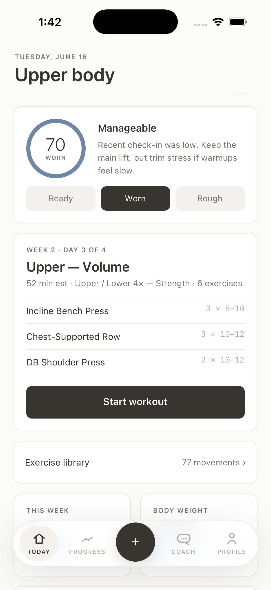 | 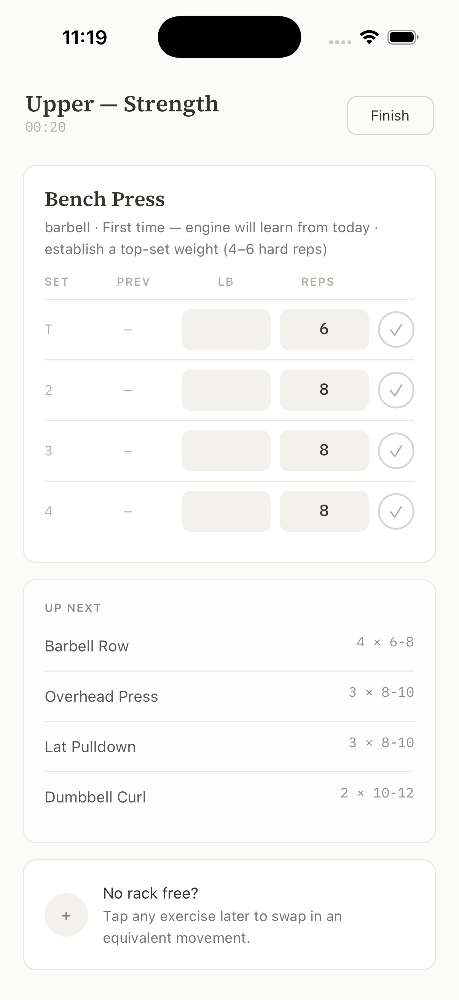 | 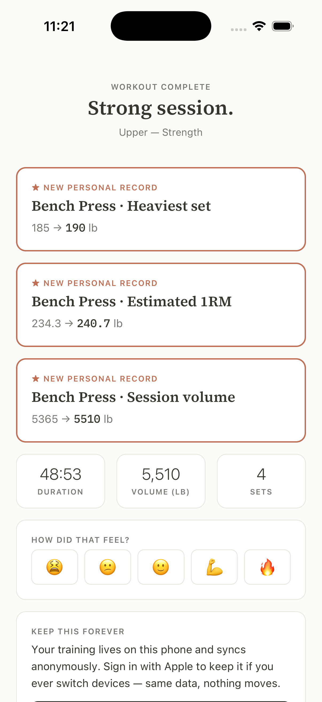 |

| Progress | Coach | Profile |
|---|---|---|
| 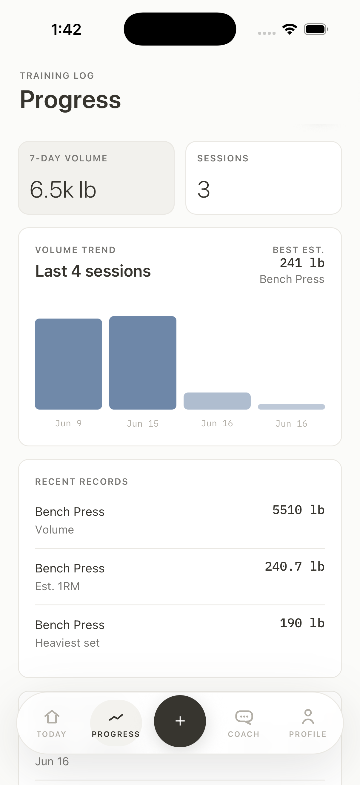 | 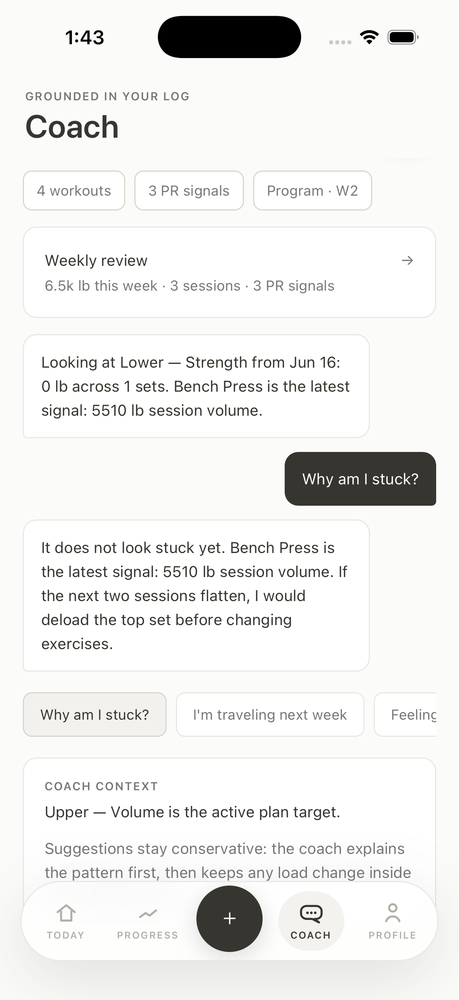 | 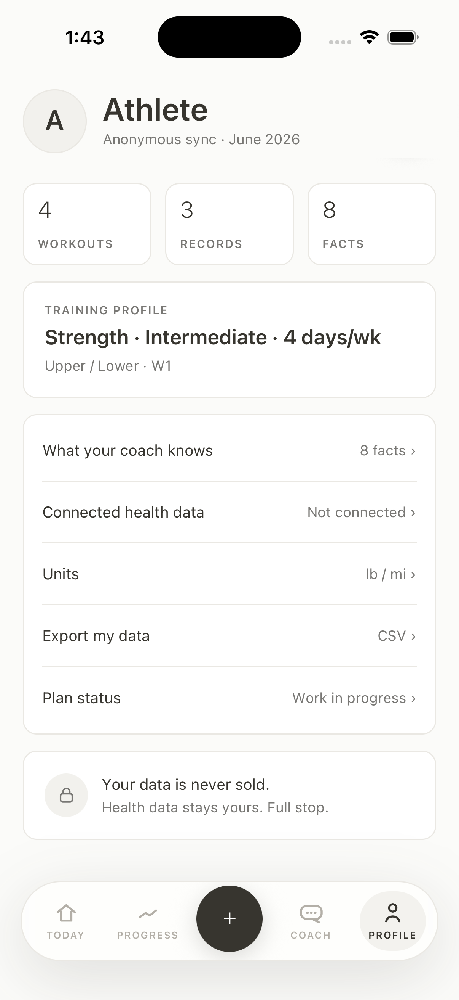 |

| Onboarding | Library | Exercise Detail |
|---|---|---|
| 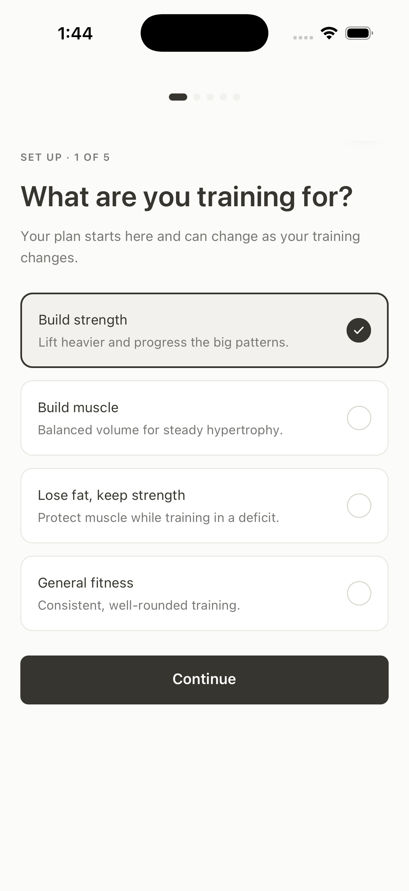 | 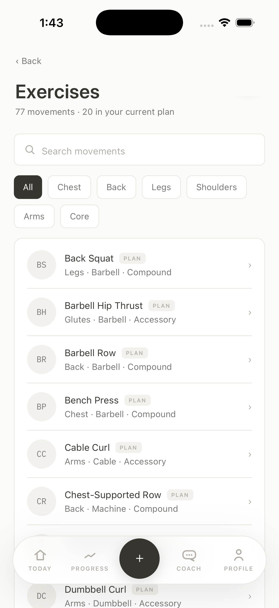 | 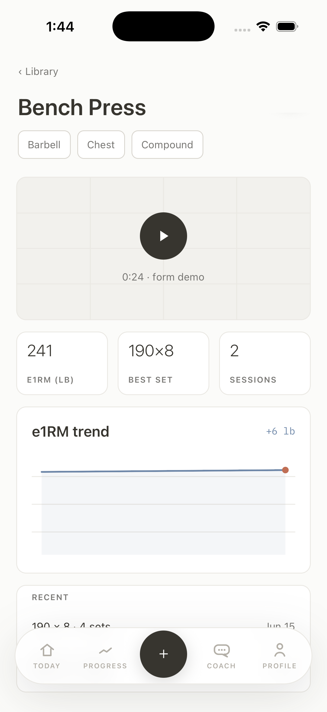 |

| Today Night | Workout Night | Summary Night |
|---|---|---|
| 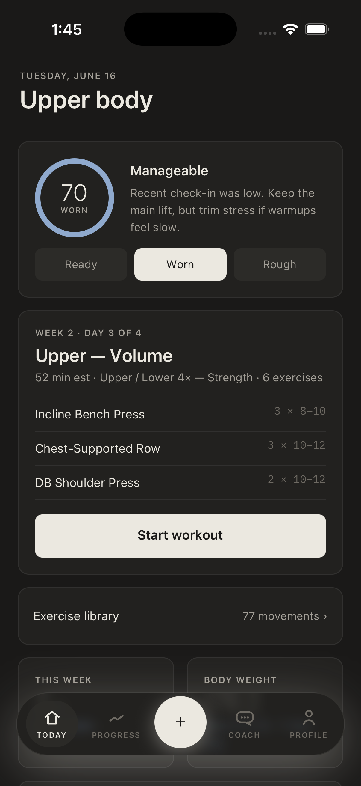 | 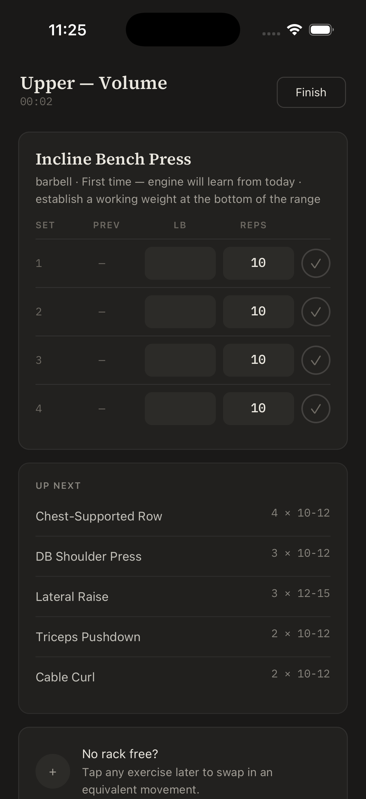 | 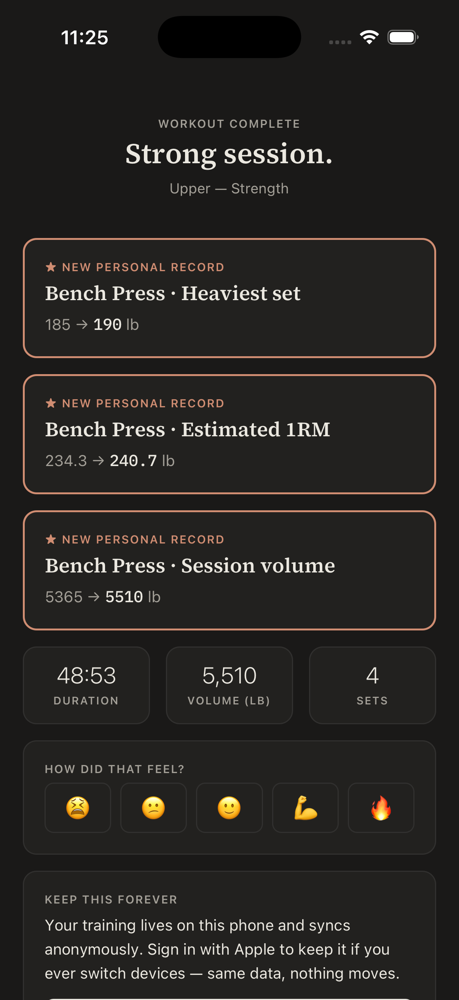 |

## Project structure

```text
atrium-fitness-app/
  scaffold/              # Expo/React Native app, engine, tokens, Supabase schema
  docs/design/           # Design system, HTML prototypes, SVG boards
  docs/product-overview.md
  docs/project-status.md
  screenshots/           # Current app screenshots
```

## Connection to creative tools

Atrium is also a project where I want to explore how creative tools can support student-built software. Beyond the code, the product needs a visual identity, onboarding content, app store assets, demo videos, and launch materials.

This is where tools like Adobe Premiere Pro, Photoshop, Illustrator, Express, and Firefly could play a major role: turning a functional app into a polished product experience.

## Running the project

The main technical workspace is in `scaffold/`.

```bash
cd scaffold
npm install
npm run typecheck
npm test
```

To start the mobile app:

```bash
cd scaffold
npm run mobile
```

## License

This project is publicly visible for portfolio and application-review purposes,
but it is not open source. All rights are reserved. See [LICENSE](LICENSE) and
[NOTICE.md](NOTICE.md).
