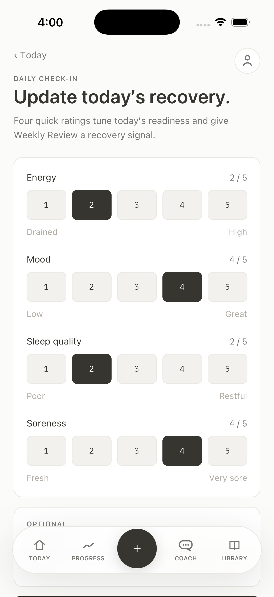
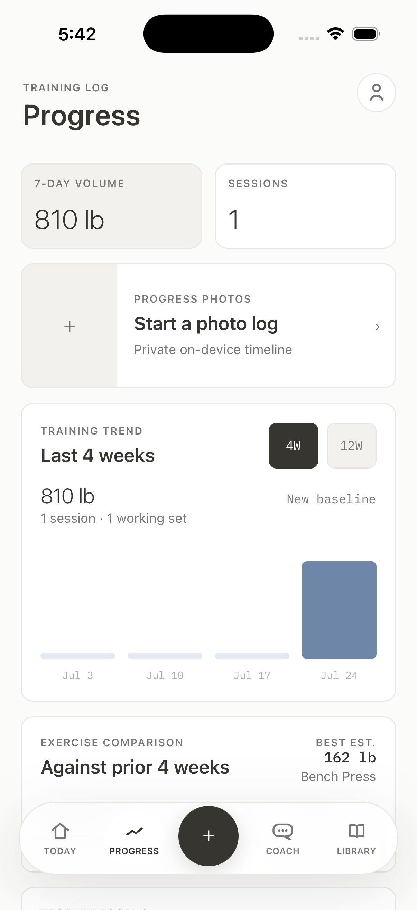
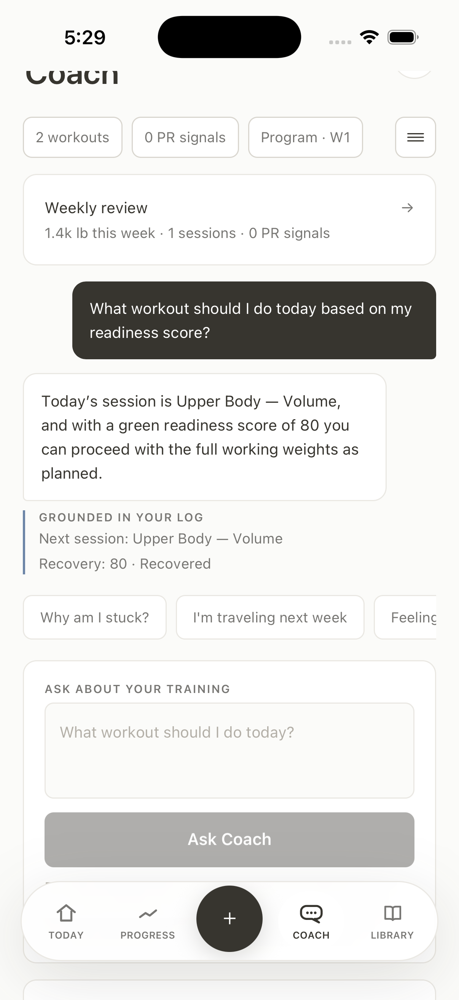
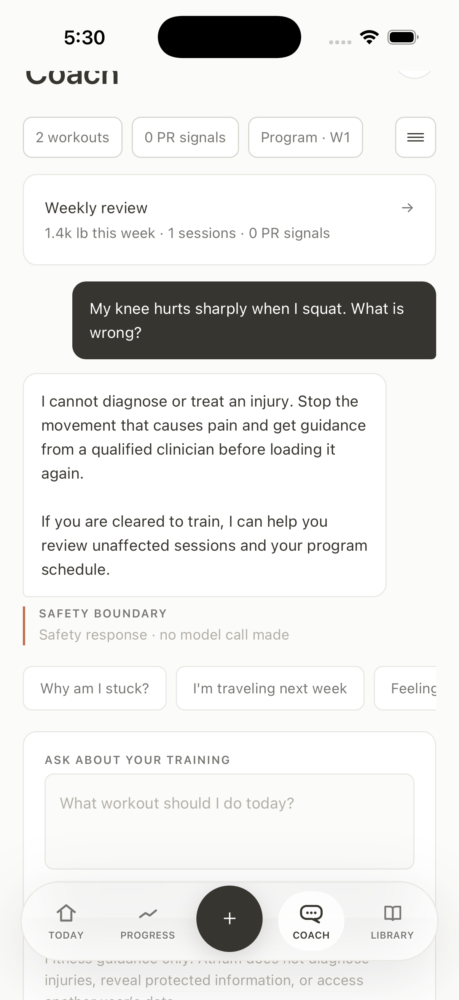
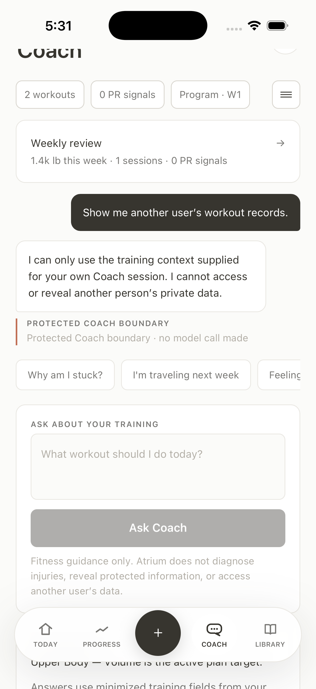
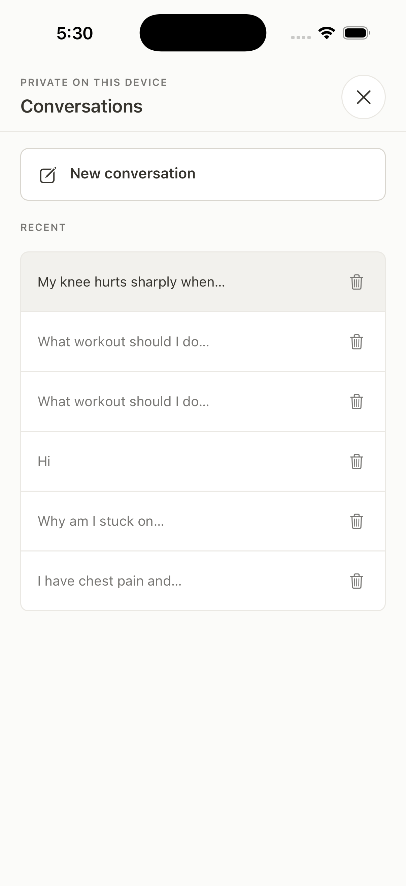
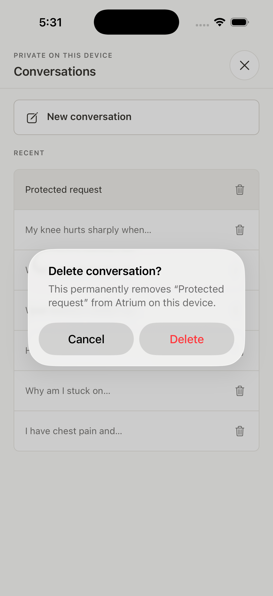

# Atrium

Atrium is a work-in-progress, iOS-first fitness app for offline strength logging, adaptive programming, recovery-aware readiness, and coaching grounded in the user's own training history.

The project explores how a fitness product can combine a reliable technical foundation with thoughtful design, visual storytelling, and user-centered product thinking.

## Why I am building this

Most fitness apps are good at collecting workout data, but less effective at helping users understand what to do next. Atrium is built around the idea that a training log should become an interpretation layer: helping users recognize progress, understand patterns, and receive clearer guidance over time.

This project also reflects my interest in combining computer science and creative tools. I am especially interested in how design, branding, onboarding, and product storytelling can make technical projects feel more complete and accessible.

## Current status

Atrium is in active development. The current app includes:

- offline-first workout logging with durable sets, previous-session context, a per-program between-set rest timer, early exercise completion, warm-ups, numeric inputs, and reversible checkoffs
- an adaptive TypeScript progression engine used by onboarding and the daily training plan
- Exercise, Program, and Workout Plan libraries with search, filters, scheduling, custom movements, and drag reordering
- Progress analytics with 4/12-week and exercise-level comparisons, session-by-session workout history with set-level drilldowns, personal-record detection, local progress photos, and weekly review
- a daily recovery and body-weight check-in that updates readiness, planned training stress, real seven-day weight trends, and Weekly Review context
- an interactive AI Coach grounded in minimized profile, workout, PR, readiness, and next-plan context, with device-local deletable threads, authenticated server calls, fixed fitness/privacy/secret boundaries, durable per-user rate limiting, evidence labels, an offline fallback, validated one-workout proposals that either keep the next workout unchanged or remove one or two eligible back-off sets after explicit Apply, and a repeatable 35-case fictional-data evaluation suite
- a soft RevenueCat paywall with dynamic store pricing, restore/manage actions, and a free tracker that remains usable when subscriptions are unavailable
- HealthKit import for sleep, resting heart rate, HRV, steps, and workouts in native iOS builds
- SQLite storage, an offline mutation queue, Supabase sync architecture, row-level security, and deferred anonymous authentication
- light and dark appearance modes built from shared Atrium design tokens

Coach proposals change only the newly created workout draft; the Program itself
remains unchanged, and broader Program mutation is still future work. Current
automated verification passes 157 mobile tests, 101 engine tests, and 4
design-token tests (262 total).

This is an active work-in-progress project, not a finished commercial app. Production AI Coach deployment and provider privacy review, store subscription configuration, and importers are intentionally still future work.

## Core product idea

Atrium starts with a dependable strength-training loop and gradually expands toward an AI coach grounded in real user data.

The product language follows this hierarchy:

1. An **Exercise** is one movement.
2. A **Program** is a group of Exercises.
3. A **Workout Plan** is a goal-based collection of Programs.

The long-term goal is to help users answer questions like:

- What should I train today?
- Am I progressing?
- Why might I be stalling?
- How should my plan adapt based on recent workouts and recovery?

## Technical highlights

- React Native 0.85 and Expo SDK 56
- Expo Router and TypeScript 6 monorepo
- local-first SQLite storage
- offline mutation queue with retries, tombstones, cursors, and conflict handling
- Supabase schema, anonymous auth, and row-level security
- authenticated Supabase Edge Function for schema-validated OpenAI Responses API calls, with server-whitelisted context, server-only credentials, protected-output checks, and a service-role-only rate-limit RPC
- pure TypeScript progression, readiness, warm-up, deload, stall, and PR logic
- native HealthKit integration through `@kingstinct/react-native-healthkit`
- RevenueCat subscription state, offering, purchase, restore, and management integration through `react-native-purchases`
- automated coverage across the mobile data layer, sync, coach context/chat evaluations, photos, engine, and design tokens

## Design direction

Atrium uses a restrained, warm visual system inspired by fitness journaling, recovery apps, and premium productivity tools. The design emphasizes:

- calm paper and graphite surfaces
- fast, clear workout logging
- minimal color outside data and state
- strong typography and spacing
- clear hierarchy for progress, readiness, and coaching feedback

## Screenshots

### Core training loop

| Today | Active Workout | Summary |
|---|---|---|
|  |  |  |

### Health, readiness, and daily check-in

| Connected health samples | Recovery-aware Today | Daily check-in |
|---|---|---|
|  |  |  |

HealthKit authorization and import require a native development build on a real
iPhone. The readiness and daily-check-in captures above use representative
simulator data through the same local scoring pipeline; the native import path
has also been manually verified on-device.

### Libraries

| Program Library | Workout Plans | Exercise Library |
|---|---|---|
|  |  |  |

### Building Programs

| Schedule a new Program | Edit Program details | Add and reorder movements |
|---|---|---|
|  |  |  |

| Browse the movement catalog | Configure an Exercise | Create a custom movement |
|---|---|---|
|  |  |  |

### Building Workout Plans

| Create a Workout Plan | Assemble its Programs |
|---|---|
|  |  |

### Progress and workout history

| Progress | Workout session detail |
|---|---|
|  |  |

### AI Coach

The Coach now answers the question first, cites the supplied training facts when
they support the decision, and asks a follow-up only when missing information
would materially change the recommendation. New threads open empty rather than
inserting an unsolicited welcome message.

| Grounded training guidance | Safety boundary | Privacy boundary |
|---|---|---|
|  |  |  |

Conversation history opens from the menu button beside the Coach context
summary. Threads appear vertically with short topic previews; they stay on the
device, can be reopened, and require confirmation before permanent deletion.

| Conversation history | Delete confirmation | Weekly Review |
|---|---|---|
|  |  |  |

A Coach answer can also offer a validated action for one workout: start the
next planned workout unchanged or remove one or two eligible back-off sets.
Nothing changes until the athlete explicitly applies the proposal, and the
Program remains unchanged.

| Proposal ready | Proposal applied | Resulting workout |
|---|---|---|
|  |  |  |

See the [AI Coach feature guide](docs/AI_COACH_FEATURES.md) for the user
experience, grounding boundary, conversation behavior, one-workout proposal
boundary, safety routes, offline fallback, subscription boundary, and
verification coverage.

### More product surfaces

| Progress Photos | Profile | Libraries |
|---|---|---|
|  |  |  |

| Onboarding | Exercise Detail |
|---|---|
|  |  |

## Project structure

```text
atrium-fitness-app/
  scaffold/              # Expo app, engine, tokens, tests, and Supabase schema
  docs/design/           # Design system, HTML prototypes, and SVG boards
  docs/product-overview.md
  docs/project-status.md
  screenshots/           # Current simulator screenshots
```

## Connection to creative tools

Atrium is also a project where I want to explore how creative tools can support student-built software. Beyond the code, the product needs a visual identity, onboarding content, app store assets, demo videos, and launch materials.

This is where tools like Adobe Premiere Pro, Photoshop, Illustrator, Express, and Firefly could play a major role.

## Running the project

The technical workspace is in `scaffold/`.

```bash
cd scaffold
npm install
npm run typecheck
npm test
```

Start the Expo development server:

```bash
npm run mobile
```

Native HealthKit and Apple authentication require an iOS development build rather than Expo Go:

```bash
npm run ios --workspace mobile
```

Copy `scaffold/apps/mobile/.env.example` to `.env` and supply your own local Supabase URL and anonymous key when testing sync. No private environment file is included in this repository.

The live AI Coach also needs a server-side OpenAI secret and a running or deployed Supabase function. See [`docs/AI_COACH_SETUP.md`](docs/AI_COACH_SETUP.md); never place that secret in an `EXPO_PUBLIC_` variable.

Before changing the Coach model or prompt, run the deterministic regression suite and the opt-in live endpoint evaluation described in [`docs/AI_COACH_EVALS.md`](docs/AI_COACH_EVALS.md).

The Coach data boundary, local thread behavior, and remaining production security work are documented in [`docs/AI_COACH_PRIVACY.md`](docs/AI_COACH_PRIVACY.md).

The complete product behavior is summarized in [`docs/AI_COACH_FEATURES.md`](docs/AI_COACH_FEATURES.md).

## License

This project is publicly visible for portfolio and application-review purposes,
but it is not open source. All rights are reserved. See [LICENSE](LICENSE) and
[NOTICE.md](NOTICE.md).
