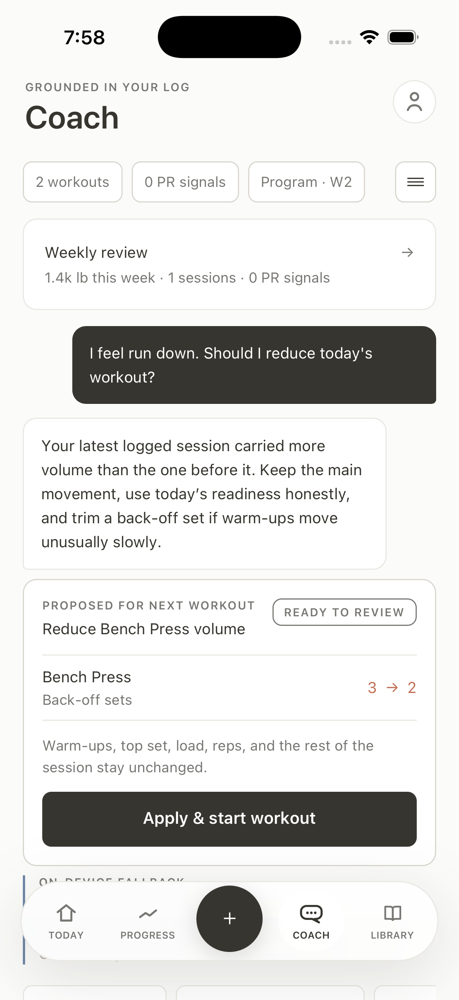
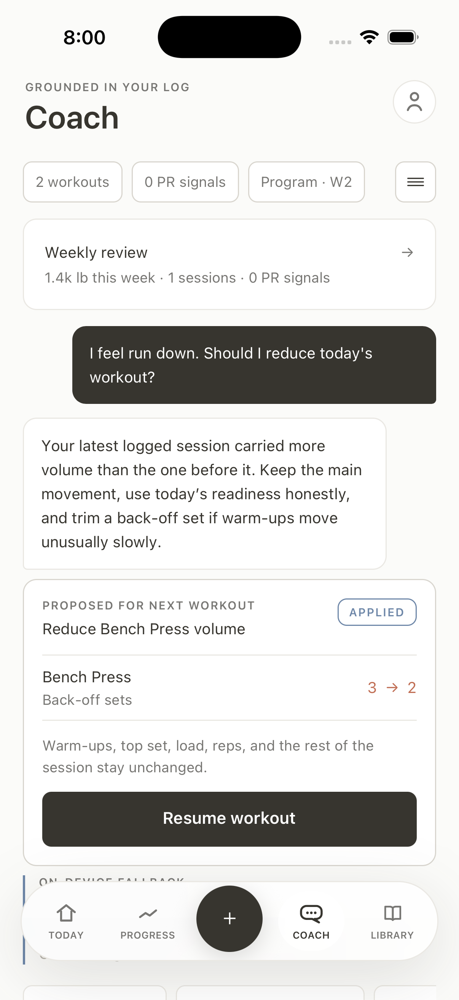
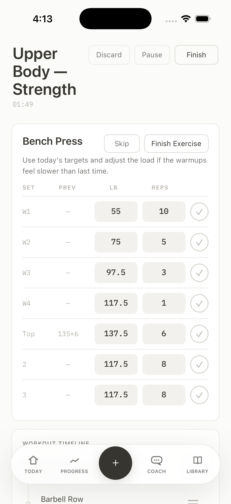

# AI Coach feature guide

Atrium's AI Coach turns the athlete's existing training log into concise,
contextual guidance. It can attach a validated, one-workout proposal to an
answer when the athlete is deciding what to do next, including an adaptive
deload authored by the deterministic engine. It does not replace the progression
engine, diagnose injuries, rewrite the active Program, or make a silent change.

The screenshots in this repository use representative simulator data. They do
not contain production user data, account contact details, raw database IDs, or
model-provider credentials.

## Conversation behavior

- A new thread begins empty. The Coach does not insert a welcome message before
  the athlete asks something.
- The answer leads with the requested decision instead of restating the entire
  log or replying only with a generic question.
- When part of a question is unsupported, the Coach briefly identifies the
  missing fact and still answers the supported part from the nearest relevant
  program or recovery evidence.
- A follow-up is included only when the missing information would materially
  change the training decision.
- A current fatigue or run-down report is treated as relevant input for the
  immediate decision. A green recovery score does not override that report. If
  the engine exposed a deload option, it takes precedence over a smaller volume
  reduction for an actionable next-workout question.
- Grounded answers can show up to three evidence labels drawn from facts Atrium
  already calculated, such as the next planned session or current readiness.
- Quick prompts remain available for common topics, but they are optional and
  do not replace free-form questions.
- Weekly Review remains a separate deterministic summary surface linked from
  the Coach screen.

## Grounded context

The mobile app builds a minimized context pack from the current athlete's local
data. Depending on what is available, it can include:

- training preferences and experience level
- the active Program and next planned session
- recent completed workouts and working-set summaries
- detected personal-record signals
- recovery and readiness summaries
- a deterministic adaptation summary built from completed active-Program
  history, recent recorded readiness inputs, and the upcoming Program week

Account contact information, raw record IDs, exact workout timestamps, raw set
history, adaptation-readiness dates, and the adaptation's per-day state sequence
are excluded from the provider view. Calendar dates remain in summarized recent
workouts and PR signals. Adaptation context is reduced to display-safe lift
names/reasons, recorded-day/red-day counts, a bounded trigger enum and label,
and the fixed one-workout prescription. The Edge Function rebuilds the received
context from an allowlist, verifies the exact prescription shape, and redacts
hostile or protected custom labels before a model call.

The checked-in function and evaluator locally expect schema version `2` and
prompt `2026-08-10.8`; those values do not attest the version of a deployed Edge
Function. The exact response fields are `answer`, `evidenceKeys`,
`followUp`, `safetyClass`, `boundaryClass`, and nullable `proposalId`. Extra
fields, including model-generated tool arguments, invalidate the response.

## Deterministic adaptive-deload signal

The provider does not decide whether a deload exists. On-device code reads only
completed workouts attached to the current active Program and uses working sets
to run the engine's stall detector. It computes readiness only for dates with
health samples or subjective tags in the current device-calendar seven-day
window. A fallback score stored at workout start is not treated as an observed
day; dates without health or check-in input are omitted rather than assumed green.

The next workout becomes eligible for a deload when any supported trigger is
present:

- two distinct lifts meet their stall criteria in the current week
- at least three recorded readiness days are red in the recent seven-day window
- the next Program day is in week 7, the scheduled checkpoint

The device keeps the display signal but suppresses repeated acute stall/readiness
deloads for seven days after a completed proposal-marked deload with at least one
completed working set. Any such completed deload also suppresses another
scheduled week-7 deload in the same Program block.

## Validated one-workout proposals

The current action scope is intentionally narrow:

- start the next planned workout unchanged; or
- remove the final one or two non-warm-up back-off sets from the first eligible
  movement, while retaining at least one back-off set; or
- when the deterministic signal is active, transform the next workout to about
  40% fewer working sets, plate-rounded loads about 10% lower, and no top sets,
  while retaining at least one working set for each movement that originally
  had working work.

A targeted reduction preserves warm-ups, the top set, loads, reps, exercise
identity, untargeted movements, and the rest of the session. A deload preserves
slot and exercise identity, rest periods, and the unmodified session's
engine-authored next progression state. Both actions change only the newly
created workout draft. Neither rewrites the persistent Program, modifies
previous logs, or schedules later workouts.

The proposal boundary is layered:

1. The device previews the current next session through the deterministic
   engine, evaluates the adaptation signal, and constructs at most three eligible
   options. When deload is available, the set is the unchanged plan, the deload,
   and at most one smaller volume reduction.
2. Each option receives an opaque deterministic ID shaped like
   `cp_0123456789abcdef`. The ID is derived from the plan fingerprint and action;
   it is not a program, day, workout, exercise, or slot database ID.
3. The provider sees only each option's ID, bounded kind (`keep_plan`,
   `reduce_volume`, or `deload_session`), and human-readable summary. Target slot
   IDs and the full local proposal object stay on-device.
4. The Edge Function independently validates and bounds the options, rejects
   conflicting duplicate IDs, drops protected summaries, and exposes only the
   option kinds relevant to the athlete's immediate question.
5. The model can return only one exact supplied ID or `null`. The server and
   client both discard an invented, malformed, expired, or unoffered ID. The ID
   is never accepted as a mutation instruction by itself.

The Coach answer and proposal are separate. A volume-reduction card shows the
exact before/after back-off-set count; a deload card shows the bounded
working-set/load targets and top-set removal. Each card states what remains
unchanged. Nothing is written until the athlete presses **Apply & start
workout** (or **Start planned workout** for the unchanged option).

At Apply time, the device regenerates the adaptation signal and next plan, then
rechecks the active workout, active Program and exact next day/week, current
readiness, plan fingerprint, exact opaque option, deload trigger, and engine
validation:

- red readiness fails closed as stale and does not create a workout
- a changed plan or no-longer-valid option expires the card and asks for a new
  Coach answer
- a different active workout blocks the proposal and routes the athlete to
  resume that workout
- an already active workout carrying the same proposal ID returns the existing
  workout instead of creating another one
- concurrent Apply requests are serialized per user; duplicate IDs resolve to
  the existing workout, different IDs do not get mislabeled as applied, and
  only one live workout and one draft are allowed
- if the Program day or plan changes, the exact option no longer resolves and
  the request fails closed before a durable write

The final plan is rebuilt once more inside the local SQLite transaction. The
workout row, any normal engine-authored slot-state advances, their sync-queue
entries, and the proposal-marked draft commit together or roll back together.
The deload transformation preserves the live plan's next progression state, so
this atomic bookkeeping is not a Coach rewrite of the Program. On success, the
normal workout screen opens and the proposal card changes to **Applied** with
**Resume workout**. While any workout is active, new model-selectable proposal
options are withheld.

The committed workout gets a bounded, synced `workout_training_intents` row. A
live row (`deleted_at is null`) marks `coach_deload`; ordinary workouts have no
live intent row, though a synced tombstone can remain. Deload sets
stay in the athlete's workout log, session detail, and Progress analytics as
work that actually happened. The progression engine and adaptation stall
detector exclude history joined to an active deload marker, so an intentionally
lower deload back-off cannot be mistaken for evidence supporting a normal load
increase. Keeping the marker outside `workouts` preserves that table's v11 wire
shape.

For a newly applied deload, the same RLS-owned row contains a versioned, bounded
`plan_json` with the exact engine base plan and deload resume plan:
Program-day/slot/exercise references,
session name/week/readiness, engine-authored per-slot rule/rest/progression
state, warm-up and working-set indices/kinds, rep or time targets,
plate-rounded loads, and deterministic engine notes plus the deload kind.
Atrium strips the opaque proposal ID before sync, and the snapshot contains no
conversation or model output. It is not a general plan-mutation payload: it is
consulted only to resume an already-active deload across devices.

Before reconstructing a missing local draft, the receiving device validates the
snapshot's bounded shape, recomputes the exact engine deload from the base plan,
and requires the Program day, slot IDs, exercises, rules, rest, and engine state
to match current local data. A missing, malformed, tampered, or stale snapshot
fails closed into an explicit no-logging recovery screen instead of creating or
silently changing a workout. Today preserves and links to that synced active
workout without trying to regenerate its plan or deleting it as an empty draft.
An early schema-v12 development marker converted from the retired workout
column may have `plan_json = null`; it still protects progression evidence, but
cannot authorize cross-device reconstruction and follows the same fail-closed
recovery path.

For newly applied deloads, the mutation batcher keeps the adjacent workout and
intent/snapshot together and `sync_upsert_coach_deload_workout` commits the
recognized pair in one RLS-enforced PostgreSQL transaction. Converted early-v12
markers can use ordinary single-row upserts. Pulls obtain a database-time barrier
and exhaust bounded keyset pages for every synced table. Ordinary pulls replay
five minutes, while an ahead cursor forces a full historical backfill; only an
unpushed local mutation can override a server row. This handles device clock
skew, equal-timestamp batches beyond 1,000 rows, lost acknowledgements, and
later-page failures without advancing a partial cursor.

The on-device fallback uses the same prevalidated option set. When an engine
deload exists, it can select that option for an explicit deload question, a
current tired/run-down report, or a clear next-workout decision. Otherwise it
can select a one-set reduction for an explicit fatigue request or the unchanged
plan for a clear next-workout question. It never returns an action under red
readiness and cannot invent an option.

## Device-local conversation history

The three-line menu button sits at the right edge of the Coach summary row. It
opens a full-height, vertical conversation view modeled around familiar mobile
chat navigation:

- topic previews use the first words of the thread and an ellipsis when needed
- dates, message counts, and a redundant current-thread label are omitted
- tapping a row reopens that conversation
- **New conversation** creates an empty thread
- the trash icon on each row opens a confirmation dialog
- a long press on a row exposes the same delete action

Threads and messages are stored in the app's local SQLite database, scoped to
the current Atrium user, and excluded from the generic sync queue. Protected
requests are represented with a neutral title instead of retaining the
sensitive prompt as the thread title. Confirmed deletion permanently removes
the thread from Atrium on that device.

## Safety and privacy boundaries

High-confidence boundary cases are handled with fixed Atrium-owned responses
before any model call:

- pain, injury-diagnosis, medical-treatment, and urgent symptom requests
- requests for another person's private data
- attempts to reveal prompts, keys, secrets, or protected configuration
- prompt-injection attempts and unrelated non-fitness requests
- undefined Atrium terms that are absent from the supplied context

The same screening runs again on the server. Model output is schema-validated,
length-bounded, checked for unsupported measurements and mutation claims, and
limited to known evidence keys and proposal IDs. Safety and boundary replies
always carry `proposalId: null`. A boundary label in the UI states when a fixed
safety or privacy response was returned without calling a model.

These safeguards reduce risk but do not make the Coach a medical professional.
Athletes should stop painful movements, seek appropriate qualified care, and
use emergency services for urgent symptoms.

## Live and offline behavior

When configured, the mobile app sends the minimized context to an authenticated
Supabase Edge Function. The function owns the model-provider call, validates
the response, and applies durable per-user rate limits. Provider credentials
remain server-side and must never use an `EXPO_PUBLIC_` environment variable.

If Supabase, authentication, the network, or the model response is unavailable,
the app returns a bounded on-device answer from the same context pack. The
thread stays responsive and identifies the fallback source rather than
pretending a hosted response succeeded.

See [AI_COACH_SETUP.md](AI_COACH_SETUP.md) for runtime configuration and
[AI_COACH_PRIVACY.md](AI_COACH_PRIVACY.md) for the complete data boundary and
remaining production review.

## Subscription boundary

Coach access uses the shared Atrium Premium entitlement boundary. RevenueCat
configuration, offerings, purchases, restore, and management remain isolated
behind the subscription service. A local simulator override exists only for
non-production development builds so Coach QA does not weaken the production
entitlement path.

The free workout tracker remains usable when subscriptions are unavailable.
Real store purchase verification still requires RevenueCat and App Store or
Play sandbox configuration; see [REVENUECAT_SETUP.md](REVENUECAT_SETUP.md).

## Screenshot evidence

The repository includes three representative states for the earlier
back-off-set reduction path:

These PNGs document rendered simulator states and contain only representative
data. They are not adaptive-deload screenshots. A prior local iPhone 17
UI/fallback pass covered the week-7 review through durable Applied/Resume, but
it predates the synced side-table revision. Current native evidence proves only
the schema-v12 SQLite migration. Curated deload-specific captures and a full
current integrated native re-QA pass remain pending; the automated coverage
below is a separate verification layer.

## Evaluation and verification

The checked-in fictional-data answer suite spans grounded training questions,
insufficient context, direct readiness decisions, current fatigue, explicit
deload and causal stall questions, pain and urgent safety routes, privacy and
secret extraction, prompt injection, off-topic requests, multilingual routing,
unsupported measurements, exact proposal selection, and false plan-mutation
claims. The staging-only security gate separately exercises authentication,
database permissions, concurrent rate limiting, metadata minimization, and
`Retry-After` behavior.

Proposal-specific automated coverage verifies:

- completed active-Program history, current-week distinct-lift stall detection,
  health/check-in-backed readiness and week-7 triggers, device-day boundaries,
  and cooldown
- deterministic opaque IDs and unchanged/reduction/deload option construction
- engine deload transformation, fixed prescription validation, and preservation
  of Program identity, protected work, and progression state
- client and server option sanitization, message-level filtering, exact response
  shape, and dual allowlisting of returned IDs
- safe history handling for valid, malformed, and protected stored replies
- no proposal on safety/boundary answers or red readiness
- stale plan/readiness rejection, active-workout race handling, per-user
  serialization, idempotent duplicate Apply, atomic workout/program-state/draft
  persistence, and transaction rollback on a failed final write
- durable `coach_deload` side-table persistence, conversion of the early v12
  development column and queued payloads, explicit null-snapshot fail-closed
  handling for those converted markers, exact cross-device resume-snapshot
  validation for newly applied deloads, tamper/staleness rejection, and
  exclusion from progression and stall evidence
- atomic remote visibility for current adjacent workout+intent pairs,
  ordinary-upsert legacy conversion coverage, database-time pull barriers,
  all-table server timestamps, complete composite keyset pagination,
  cursor-backfill/recovery, and server-authoritative clean-row reconciliation

The automated suite is a regression floor, not a substitute for qualified
fitness, clinical-safety, privacy, provider-retention, native interaction, or
visual review. Supabase migrations `0005_workout_training_intent.sql` and
`0006_sync_pull_safety.sql` must be applied before a schema-v12 client queries
the new table or sync RPCs. Production deload
creation must remain off until a server- or store-enforced minimum supported
client version excludes schema-v11 syncing clients; that enforcement is not
implemented yet. The only production opt-in syntax is
`EXPO_PUBLIC_ATRIUM_ADAPTIVE_DELOAD_ENABLED=1`. Local and development builds
keep the feature available for review. The updated function has not yet been
deployed, and evaluator prompt/schema labels are local expectations rather than
deployed-version attestation. The earlier UI/fallback pass predates the side
table; current native evidence covers only schema-v12 SQLite migration. Full
integrated native re-QA and checked-in deload captures remain pending. Exact
commands and case contracts are in
[AI_COACH_EVALS.md](AI_COACH_EVALS.md).

## Main implementation files

- `apps/mobile/src/coach/context.ts` builds minimized training context and the
  current proposal option set.
- `apps/mobile/src/coach/adaptation.ts` derives the bounded deload signal from
  completed active-Program history, recorded readiness inputs, Program week,
  and prior completed deloads.
- `apps/mobile/src/coach/proposals.ts` constructs, validates, applies, marks,
  rechecks, and idempotently starts one-workout proposals.
- `apps/mobile/src/coach/chat.ts` owns deterministic routing, response
  validation, evidence/proposal filtering, and the on-device fallback.
- `apps/mobile/src/coach/history.ts` owns user-scoped local threads and
  protected-input retention.
- `apps/mobile/src/coach/service.ts` invokes the Edge Function and falls back on
  bounded failure states.
- `apps/mobile/src/app/(tabs)/coach.tsx` implements the Coach screen,
  conversation navigation, proposal cards, replies, evidence, and deletion.
- `apps/mobile/src/app/review.tsx` renders the Weekly Review training-strain and
  one-session deload explanation from the same deterministic signal.
- `supabase/functions/coach-chat/index.ts` authenticates requests, filters
  message-relevant options, rate-limits users, and owns model-provider calls.
- `supabase/functions/_shared/coach.ts` validates context and options, defines
  the locally expected prompt `2026-08-10.8` and schema `2`, and allowlists
  structured replies; these constants do not attest a deployed function.
- `apps/mobile/test/coachAdaptation.test.ts` covers signal inputs, device-day
  boundaries, completion requirements, and cooldown. `coachProposals.test.ts`
  covers proposal construction, deload preservation, exact revalidation, and
  the atomic one-workout write boundary; the other Coach tests cover chat,
  context, history, server-model validation, and evaluator integration.
- `supabase/migrations/0004_coach_security.sql` stores only rate-limit event
  metadata: user ID and timestamp.
- `supabase/migrations/0005_workout_training_intent.sql` adds the RLS-owned,
  bounded synced intent and engine resume snapshot required by the deload
  history and cross-device-resume boundary.
- `supabase/migrations/0006_sync_pull_safety.sql` adds the database-time
  barrier, RLS-preserving keyset pull, atomic workout+intent upsert, all-table
  server timestamps, and supporting sync indexes.
